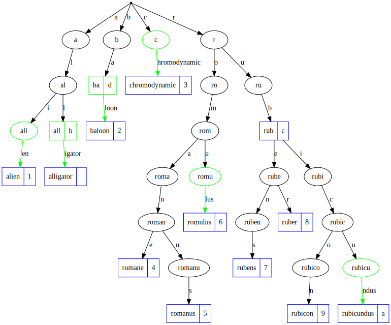

[](https://github.com/features/actions)
[](https://pkg.go.dev/github.com/snorwin/gorax)
[](https://github.com/snorwin/gorax/actions)
[](https://goreportcard.com/report/github.com/snorwin/gorax)
[](https://coveralls.io/github/snorwin/gorax?branch=main)
[](https://github.com/snorwin/gorax/releases)
[](https://opensource.org/licenses/MIT)

# gorax
`gorax` is a Go [radix tree](https://en.wikipedia.org/wiki/Radix_tree) implementation inspired by the ANSI C [Rax](https://github.com/antirez/rax) radix tree.

## WIP
:warning: This project is a work in progress and the following ToDos need to be resolved before the first release:
- [ ] Implement `Delete`
- [ ] Write documentation and provide some examples 
- [ ] Compare benchmark with other radix Go implementations
- [ ] Improve memory consumption and performance 

## Example
```go
t := gorax.FromMap(map[string]interface{}{
    "alligator":     nil,
    "alien":         1,
    "baloon":        2,
    "chromodynamic": 3,
    "romane":        4,
    "romanus":       5,
    "romulus":       6,
    "rubens":        7,
    "ruber":         8,
    "rubicon":       9,
    "rubicundus":    "a",
    "all":           "b",
    "rub":           "c",
    "ba":            "d",
})
```


## Trivia
In Star Wars `gorax` are a seldom-seen species of humanoids of gigantic proportion that are native to the mountains of Endor.