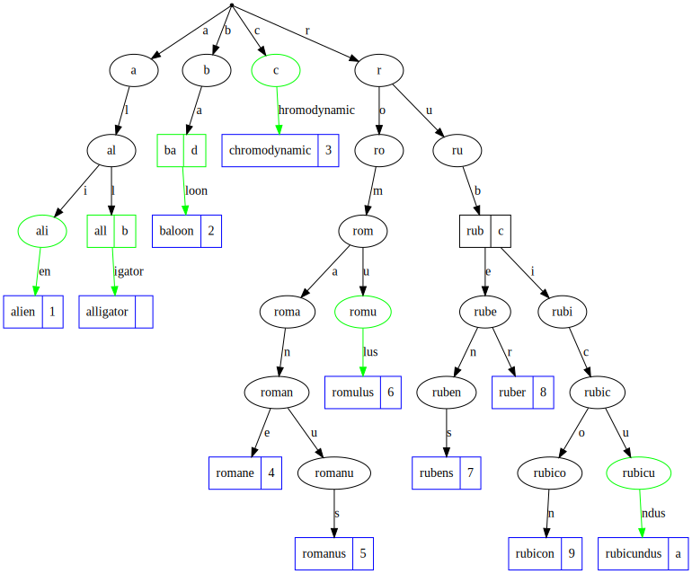

[](https://github.com/features/actions)
[](https://pkg.go.dev/github.com/snorwin/gorax)
[](https://github.com/snorwin/gorax/actions)
[](https://goreportcard.com/report/github.com/snorwin/gorax)
[](https://coveralls.io/github/snorwin/gorax?branch=main)
[](https://github.com/snorwin/gorax/releases)
[](https://opensource.org/licenses/MIT)

# gorax
**gorax** is a Go [radix tree](https://en.wikipedia.org/wiki/Radix_tree) implementation inspired by the ANSI C [Rax](https://github.com/antirez/rax) radix tree.

## Example Tree

```go
t := gorax.FromMap(map[string]interface{}{
    "alligator":     nil,
    "alien":         1,
    "baloon":        2,
    "chromodynamic": 3,
    "romane":        4,
    "romanus":       5,
    "romulus":       6,
    "rubens":        7,
    "ruber":         8,
    "rubicon":       9,
    "rubicundus":    "a",
    "all":           "b",
    "rub":           "c",
    "ba":            "d",
})
```

## Performance
The **gorax** `Insert` and `Get` are `O(k)` operations. In many cases, this can be faster than a hash table because the hash function is an `O(k)` operation too and in the worst case depending on how collisions are handled it may take even longer. Furthermore, hash tables have very poor cache locality.

### Benchmark
The benchmark demonstrates well that the insertion and get times are independent of the number of elements stored in the **gorax** radix tree. In average insert and operations are taking less than `500ns/op` measured on an 8 Core (11th Gen i7) Intel CPU.
```
goos: linux
goarch: amd64
pkg: github.com/snorwin/gorax
cpu: 11th Gen Intel(R) Core(TM) i7-1160G7 @ 1.20GHz
BenchmarkInsert1-8       	 2935486	       437.9 ns/op
BenchmarkInsert10-8      	  284378	      4073 ns/op
BenchmarkInsert100-8     	   33601	     36614 ns/op
BenchmarkInsert1000-8    	    3181	    383915 ns/op
BenchmarkInsert10000-8   	     268	   4245608 ns/op
BenchmarkGet1-8          	10413225	       125.3 ns/op
BenchmarkGet10-8         	 2489961	       466.6 ns/op
BenchmarkGet100-8        	  306944	      3282 ns/op
BenchmarkGet1000-8       	   60535	     31144 ns/op
BenchmarkGet10000-8      	    5689	    358072 ns/op
```

## Trivia
In Star Wars **gorax** are a seldom-seen species of humanoids of gigantic proportion that are native to the mountains of Endor.